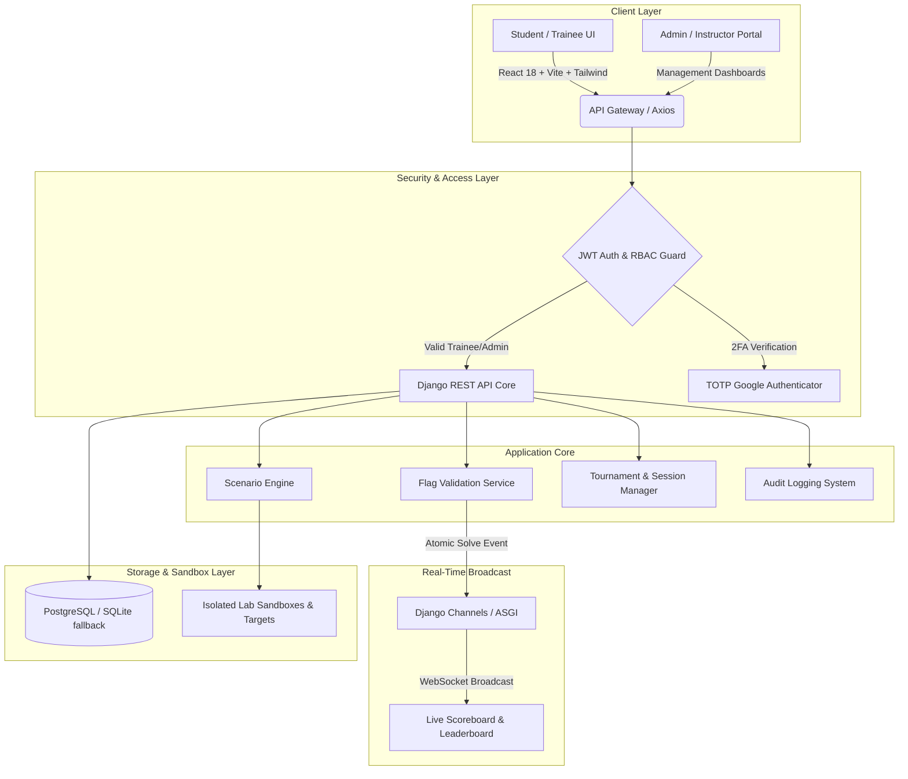

# 🛡️ OffensiveGrid — Enterprise CTF & Cyber Range Platform

<div align="center">

[](https://cszone.pk)
[](https://python.org)
[](https://djangoproject.com)
[](https://react.dev)
[](https://typescriptlang.org)
[](#-license--authorization-policy)
[](#-security-guardrails--anti-cheat)

**OffensiveGrid** is an authentic, enterprise-grade Cyber Warfare Simulation and Capture The Flag (CTF) training platform. Engineered for ethical hackers, penetration testers, defense trainees, academic institutions, and corporate security teams.

[Explore Platform](https://cszone.pk) • [System Architecture](#-system-architecture) • [Scoring & Ranks](#-scoring-engine--rank-mechanics) • [Setup Guide](#-local-setup-guide) • [License & Permission](#-license--authorization-policy)

</div>

---

## 📌 Executive Overview & Purpose

In modern cybersecurity, theoretical knowledge without authentic, live exploitation leaves defenders and penetration testers unprepared for real-world adversaries. Traditional CTF environments often suffer from static challenges, lack of attempt quota enforcement, vulnerability to flag sharing, and sluggish leaderboard updates.

**OffensiveGrid** was developed to bridge this gap:
- **Authentic Attack-Defense Simulations:** Live isolated sandboxes replicating production developer oversights, web exploits, header leaks, binary vulnerabilities, and OSINT vectors.
- **Strict Anti-Brute-Force Guardrails:** Atomic attempt quotas enforced at the database layer to eliminate flag guessing.
- **Low-Latency WebSocket Telemetry:** Sub-second live scoring and rank updates broadcast across tournament grids.
- **Role-Based Governance (RBAC):** Fine-grained permission matrix separating Trainees, Instructors, Administrators, and Super Administrators.

---

## 💡 Real-World Importance & Strategic Impact

### 🏢 1. For Enterprises & Organizations
- **Red Team & Blue Team Drills:** Conduct authentic simulated adversary campaigns and incident response drills inside safe, isolated network sandboxes.
- **Talent Recruitment & Skill Auditing:** Evaluate candidates using real-world vulnerability scenarios rather than multiple-choice questions.
- **Continuous DevSecOps Training:** Upskill development teams on secure coding by demonstrating how developer oversights (e.g., hidden comments, exposed response headers, misconfigured CORS) are exploited.

### 🚀 2. For Cybersecurity Career Aspirants & Startups
- **From Theory to Live Exploitation:** Build hands-on muscle memory by interacting with live HTTP servers, response headers, and reverse engineering challenges.
- **Verifiable Skill Metrics:** Real-time scoreboard and solve precision tracking that serve as tangible proof of capability for job interviews and client audits.
- **Professional Mindset:** Enforces disciplined testing through attempt quotas, preventing careless automated fuzzing and fostering methodical reconnaissance.

### 🎓 3. For Universities & Academic Institutions
- **Turnkey Cyber Range Lab:** Plug-and-play platform ready for cybersecurity labs, coursework assignments, and university-wide hackathons.
- **Automated Grading & Integrity:** Instant, deterministic flag evaluation eliminates manual grading while strict attempt limits prevent brute-force abuse.
- **Tournament Mode:** Synchronized global timers and live leaderboard displays ideal for collegiate cyber defense competitions.

---

## 🏗️ System Architecture

OffensiveGrid employs a decoupled client-server architecture with an asynchronous real-time message broker:



---

## ⚡ Scoring Engine & Rank Mechanics

OffensiveGrid's scoring algorithm rewards precision, speed, and disciplined problem solving:

```
Total Trainee Score = Σ (Base Scenario Points - Penalty Adjustments)
```

| Component | Mechanism & Enforcement |
| :--- | :--- |
| **Base Points** | Awarded immediately upon first correct flag capture (e.g., `50 PTS`, `100 PTS`, `250 PTS`). |
| **Strict Attempt Limits** | Each scenario defines a maximum attempt quota (e.g., `3 Tries`). Reaching the quota locks the scenario. |
| **Zero-Duplicate Solves** | A user cannot capture the same flag twice or accumulate duplicate points for previously solved challenges. |
| **Leaderboard Rank Tie-Breaker** | When trainees share equal point totals, rank priority is automatically awarded to the trainee with the **earliest last-solve timestamp**. |
| **Admin Second-Chance Grant** | Super Administrators can review blocked trainees and grant `+1 extra attempt` directly from the management console without compromising score integrity. |

---

## 🚀 Local Setup Guide

OffensiveGrid can be deployed locally on both **Windows** and **Linux** environments.

### 📋 Prerequisites
- **Git** (`git --version` >= 2.30)
- **Python** 3.11 or higher (`python --version`)
- **Node.js** 18+ and **npm** (`node -v`, `npm -v`)

---

### 🪟 Windows Setup (PowerShell / CMD)

#### 1. Clone the Repository (Authorized Users Only)
```powershell
git clone https://github.com/haroonatieeq352/OffensiveGrid.git
cd OffensiveGrid
```

#### 2. Backend Setup
```powershell
# Navigate to backend and create virtual environment
cd backend
python -m venv venv
.\venv\Scripts\Activate.ps1

# Install backend dependencies
pip install -r requirements.txt

# Configure environment variables
Copy-Item .env.example .env

# Run database migrations
python manage.py migrate

# Seed standard challenges, categories, difficulties, and default accounts
python manage.py seed_offensivegrid

# Launch Django development server
python manage.py runserver
```
*Backend will be running at:* `http://localhost:8000`

#### 3. Frontend Setup
Open a **new terminal window**:
```powershell
cd OffensiveGrid\frontend

# Install dependencies
npm install

# Start Vite development server
npm run dev
```
*Frontend will be running at:* `http://localhost:5173`

#### ⚡ One-Click Windows Launcher:
Double-click `start_offensivegrid.bat` (or run `./start_offensivegrid.ps1` in PowerShell) to launch both Backend and Frontend dev servers automatically.

---

### 🐧 Linux Setup (Ubuntu / Debian / Kali / Arch)

#### 1. Clone the Repository
```bash
git clone https://github.com/haroonatieeq352/OffensiveGrid.git
cd OffensiveGrid
```

#### 2. Backend Setup
```bash
cd backend
python3 -m venv venv
source venv/bin/activate

# Install dependencies
pip install --upgrade pip
pip install -r requirements.txt

# Set up environment variables
cp .env.example .env

# Database migrations & database seeding
python manage.py migrate
python manage.py seed_offensivegrid

# Start ASGI / WSGI server
python manage.py runserver 0.0.0.0:8000
```

#### 3. Frontend Setup
Open a **new terminal tab**:
```bash
cd OffensiveGrid/frontend
npm install
npm run dev -- --host 0.0.0.0
```

---

## 🔒 Security Guardrails & Anti-Cheat

OffensiveGrid is built with a **Zero-Trust** security posture:
- **Server-Side Quota Enforcement:** Prevents client-side attempt tampering via atomic DB transactions (`select_for_update`).
- **TOTP Two-Factor Authentication:** Mandatory Google Authenticator 2FA for all administrative accounts.
- **JWT With Auto-Refresh Rotation:** Short-lived access tokens (60 min) with refresh token blacklisting.
- **Strict Flag Redaction:** Flag hashes and values are never exposed to trainees via network requests or frontend state.

---

## 🔐 Hardware Authorization & Machine Activation Gate

To protect proprietary intellectual property while keeping this repository publicly discoverable for international recruiters, universities, and enterprise clients, **OffensiveGrid integrates a Zero-Trust Cryptographic Hardware Licensing Gate**.

### 🛡️ How the Protection Works:
1. **Deterministic Machine Fingerprint:** Upon launch, the backend derives a unique Hardware ID (HWID) based on physical machine characteristics (e.g. `OG-8492-F92A-K29B`).
2. **Cryptographic Validation:** Without an official cryptographic license signed by Haroon Atieeq matching that specific HWID, all backend API requests and dev servers are **instantly locked**:
   ```text
   ================================================================================
   ⛔ [OffensiveGrid Security Gate]: Unauthorized Machine! This instance is locked.
   You require an official authorization key from Haroon Atieeq to run OffensiveGrid.
   Hardware ID: OG-8492-F92A-K29B
   Contact: haroonatieeq6@gmail.com to request access.
   ================================================================================
   ```
3. **Frontend Lock Screen:** Unlicensed instances automatically render the glassmorphism **OffensiveGrid Security Gate Modal**, allowing users to copy their Hardware ID with 1 click and enter their issued activation key.
4. **Anti-Tampering & VAPT/Pentester Defense:**
   - **HMAC-SHA256 Signatures:** License keys (`OGLIC.<payload>.<sig>`) are cryptographically sealed with a salted master key. Modifying the payload immediately invalidates the signature (`TAMPERED_KEY`).
   - **Hardware Binding:** The key incorporates the deterministic machine hash; copying an authorized key to a different machine triggers `HARDWARE_MISMATCH`.
   - **Time-Bound Revocation:** Expiration timestamps are embedded within the signed envelope; clock manipulation cannot extend expired licenses.
   - **Zero Secrets in Repository:** The generator script (`generate_license.py`) is excluded from Git tracking and exists exclusively on the author's development machine.

### 🔑 How to Request an Evaluation License Key:
If you are an **international client, corporate security team, university instructor, or Final Year Project (FYP) student** evaluating OffensiveGrid:
1. Clone the repository and run the project to obtain your unique **Hardware ID**.
2. Email [haroonatieeq6@gmail.com](mailto:haroonatieeq6@gmail.com) with the subject `OffensiveGrid Evaluation License Request` containing:
   - Your Name & Organization / University
   - Intended Use (e.g. Academic Research, Corporate Evaluation, Final Year Project)
   - Your Machine Hardware ID (`OG-XXXX-XXXX-XXXX`)
3. Upon approval, you will receive your signed `OGLIC-...` key. Paste it into your `backend/.env`:
   ```bash
   OFFENSIVEGRID_LICENSE_KEY=OGLIC-your-activation-key-here
   ```
   *Or paste it directly into the web UI activation prompt to unlock all scenarios instantly!*

---

## 👤 Founder & Lead Developer — Haroon Atieeq

<div align="center">

### **Haroon Atieeq** (Haroon Atieeque)
**Junior Penetration Tester | VAPT & Application Security**  
*Lead Developer & Architect, OffensiveGrid*

[](https://www.linkedin.com/in/haroon-atieeque-2b8867378)
[](https://github.com/haroonatieeq352)
[](mailto:haroonatieeq6@gmail.com)
[](https://cszone.pk)

</div>

Haroon Atieeq is a Junior Penetration Tester at **CSZone Pvt. Limited**, delivering comprehensive Vulnerability Assessment and Penetration Testing (VAPT) engagements for international clients across web applications and REST APIs. His testing workflows strictly adhere to **OWASP WSTG, PTES, and NIST SP 800-115** methodologies, with findings mapped to **OWASP Top 10, ISO 27001, NIST SP 800-53, and GDPR**.

- 🎓 **Education:** BS, Cyber Security and Digital Forensics — The Islamia University of Bahawalpur.
- 🏆 **IEEE Publication:** **CyberMaze** awarded Best Final Year Project (FYP) and officially published in **IEEE**.
- 🛡️ **Critical Vulnerability Research:** Identified a CVSS 9.8 Critical vulnerability during a live client VAPT engagement (ranbval.com).
- 🔬 **Industry Research:** Selected for a Microsoft-sponsored Threat Intelligence Analyst research study on Upwork/Lifted focused on CVE analysis.
- 📜 **Professional Certifications:** Certified Ethical Hacker (CEH), Cisco Certified Network Associate (CCNA), Critical Infrastructure Protection (ICIP - OPSWAT), TATA Cyber Security Analyst, Linux for Hackers.
- 💼 **VAPT Deliverables:** Author of a 94-page Enterprise VAPT Playbook covering 36 tools (161/161 checks validated) and architect of OffensiveGrid.

---

## 📄 License & Authorization Policy

```text
================================================================================
OFFENSIVEGRID PROPRIETARY & AUTHORIZED USE LICENSE
Copyright (c) 2026 Haroon Atieeq. All Rights Reserved.
================================================================================
```

**OffensiveGrid** is proprietary software owned exclusively by **Haroon Atieeq**.

### ⚠️ Permission Requirement for Cloning & Local Execution:
- **Unauthorized cloning, downloading, copying, redistribution, public hosting, or commercial use of this repository is STRICTLY PROHIBITED.**
- Students, academic institutions, and security researchers wishing to clone, run, or deploy this project locally **must first request and receive written authorization** from the author.

#### 📬 Requesting Access & Collaboration:
To request permission to clone, evaluate, or collaborate on OffensiveGrid:
- **Founder & Lead Developer:** Haroon Atieeq
- **Email:** [haroonatieeq6@gmail.com](mailto:haroonatieeq6@gmail.com)
- **Official Domain:** [https://cszone.pk](https://cszone.pk)
- **GitHub Profile:** [@haroonatieeq352](https://github.com/haroonatieeq352)

---

<div align="center">
  <sub>Engineered with precision for the next generation of cybersecurity defenders. • © 2026 OffensiveGrid</sub>
</div>
